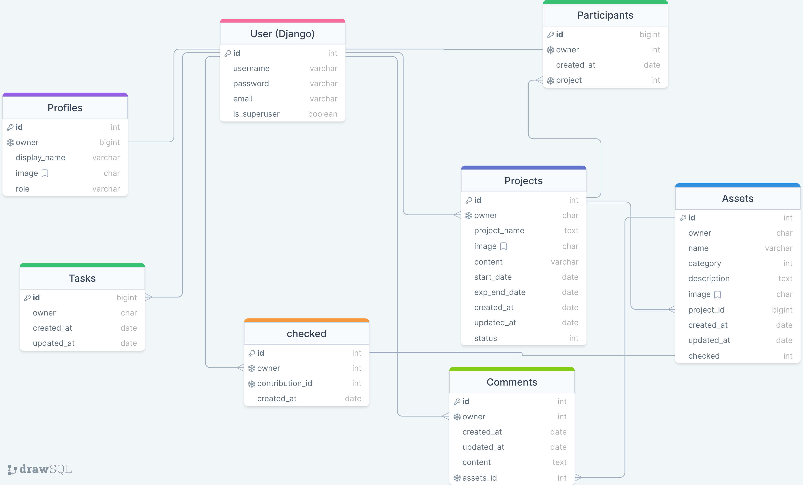

***

Dinomizer is built using Django Rest Framework for the backend and React JS for the frontend. This project was created as my fifth portfolio project for my Diploma in Web Application Development at Code Institute.

Dinomizer is a web application designed to assist Creative Agencies with teams dispersed globally or working remotely. This application streamlines asset retrieval for projects by centralizing all assets in one location. This ensures that all project stakeholders can access the latest version of required assets, thus minimizing time loss.

## Project Goals

- Full featured assets sharing service
- Create and partecipate to a project
- Upload assets like images, videos, audio and text
- Contribute to a project
- Get approvals by the project manager (project owner) on the assets uploaded

## Table of contents
- [Dinomizer](#Dinomizer-logo)
  * [Project goals](#project-goals)
  * [Table of contents](#table-of-contents)
  * [Planning and ideas](#planning-and-ideas)
  * [API endpoints](#api-endpoints)
    + [Data Models](#data-models)
      - [Profile](#profile)
      - [Project](#project)
      - [Asset](#asset)
      - [Participant](#participant)
      - [Checks](#checks)

  * [Permissions](#permissions)
  
  * [Frameworks, libraries and dependencies](#frameworks-libraries-and-dependencies)
    + [django-cloudinary-storage](#django-cloudinary-storage)
    + [dj-rest-auth](#dj-rest-auth)
    + [djangorestframework-simplejwt](#djangorestframework-simplejwt)
    + [dj-database-url](#dj-database-url)
    + [psychopg2](#psychopg2)
    + [django-cors-headers](#django-cors-headers)
  * [Testing](#testing)
    + [Automated tests](#automated-test)
    + [Manual testing](#manual-testing)
  * [Bugs and Issues](#bugs)
  * [Python validation](#python-validation)
  * [Deployment](#deployment)
  * [Credits](#credits)
  * [Notes](#notes)

## Planning and ideas
Dinomizer is inspired by the Code Institute Frontend module's walkthrough project. It was conceptualized based on my background in video production and communication. I envisioned a communication agency where team members are located in different physical locations but need to collaborate effectively on communication projects. Dinomizer serves as the platform where these dispersed teams can easily share files, assets, and ideas to successfully execute their projects.
To begin the planning process, I first streamlined all the project objectives and meticulously crafted various user stories for the frontend application. These user stories are comprehensively detailed in the [README](https://github.com/fabi8bit/dinomizer_react_pp5/blob/main/README.md) of the frontend application.
To support these user stories and the overall functionality of the application, I initiated the development of API endpoints and data models.

## API Endpoints

| RESOURCE     | URL           | END POINT                                                                                                                                                                                                  | CRUD / METHOD  | DATA                                                                                | DESCRIPTION                                                                                                                                                                                                                                                                                                                            | MVP | USER STORIES                                                                                                                                                                                                                                                                                                                                         | NOTES                                                                                                                                                                                                                                                                                                                                                                                                                                       |
| ------------ | ------------- | ---------------------------------------------------------------------------------------------------------------------------------------------------------------------------------------------------------- | -------------- | ----------------------------------------------------------------------------------- | -------------------------------------------------------------------------------------------------------------------------------------------------------------------------------------------------------------------------------------------------------------------------------------------------------------------------------------- | --- | ---------------------------------------------------------------------------------------------------------------------------------------------------------------------------------------------------------------------------------------------------------------------------------------------------------------------------------------------------- | ------------------------------------------------------------------------------------------------------------------------------------------------------------------------------------------------------------------------------------------------------------------------------------------------------------------------------------------------------------------------------------------------------------------------------------------- |
| Profiles     | /profiles     |                                                                                                                                                                                                            | create/POST    | name,<br>content,<br>image                                                          | A profile is authomatically crated upon user creation when signing up                                                                                                                                                                                                                                                                  | YES | [#1](https://github.com/fabi8bit/dinomizer_react_pp5/issues/1)<br>[#2](https://github.com/fabi8bit/dinomizer_react_pp5/issues/2)<br>[#3](https://github.com/fabi8bit/dinomizer_react_pp5/issues/3)<br>[#6](https://github.com/fabi8bit/dinomizer_react_pp5/issues/6)<br>[#7](https://github.com/fabi8bit/dinomizer_react_pp5/issues/7)<br>           |                                                                                                                                                                                                                                                                                                                                                                                                                                             |
| Profiles     | /profiles     | id,<br>owner,<br>created_at,<br>updated_at,<br>name,<br>content,<br>image,<br>is_owner                                                                                                                     | retrieve/GET   |                                                                                     | When a user clicks on the profile icon, can see the detail of the clicked profile                                                                                                                                                                                                                                                      | YES | [#28](https://github.com/fabi8bit/dinomizer_react_pp5/issues/28)                                                                                                                                                                                                                                                                                     |                                                                                                                                                                                                                                                                                                                                                                                                                                             |
| Profiles     | /profiles     |                                                                                                                                                                                                            | update/PUT     | name,<br>content,<br>image                                                          | If the user is the owner of the profile, can edit the details for his profile                                                                                                                                                                                                                                                          | YES | [#31](https://github.com/fabi8bit/dinomizer_react_pp5/issues/31),<br>[#32](https://github.com/fabi8bit/dinomizer_react_pp5/issues/32)                                                                                                                                                                                                                |                                                                                                                                                                                                                                                                                                                                                                                                                                             |
| Profiles     | /profiles     |                                                                                                                                                                                                            | destroy/DELETE |                                                                                     | N/A will be implemented in the future                                                                                                                                                                                                                                                                                                  | NO  |                                                                                                                                                                                                                                                                                                                                                      | Due to time constraints                                                                                                                                                                                                                                                                                                                                                                                                                     |
| Profiles     | /profiles     |                                                                                                                                                                                                            | list/GET       |                                                                                     |                                                                                                                                                                                                                                                                                                                                        | YES |                                                                                                                                                                                                                                                                                                                                                      |                                                                                                                                                                                                                                                                                                                                                                                                                                             |
| RESOURCE     | URL           | END POINT                                                                                                                                                                                                  | CRUD / METHOD  | DATA                                                                                | DESCRIPTION                                                                                                                                                                                                                                                                                                                            | MVP | USER STORIES                                                                                                                                                                                                                                                                                                                                         | NOTES                                                                                                                                                                                                                                                                                                                                                                                                                                       |
| Projects     | /projects     |                                                                                                                                                                                                            | create/POST    | project_name,<br>start_date,<br>expected_end_date,<br>content,<br>image,<br>status, | As a registered and logged in user, it is possible to create projects. This gives you the status of project owner. When project owner, a user has the permission to check all the ASSETS connected to this project. See "create/POST check" below.                                                                                     | YES | [#8](https://github.com/fabi8bit/dinomizer_react_pp5/issues/8)                                                                                                                                                                                                                                                                                       |                                                                                                                                                                                                                                                                                                                                                                                                                                             |
| Projects     | /projects     | id,<br>owner,<br>profile_id,<br>project_name,<br>profile_image,<br>start_date,<br>expected_end_date,<br>updated_at,<br>content,<br>image,<br>is_owner,<br>status,<br>participant_id,<br>participants       | retrieve/GET   |                                                                                     | As a registered and logged in user, I can list all the projects available                                                                                                                                                                                                                                                              | YES | [#12](https://github.com/fabi8bit/dinomizer_react_pp5/issues/12)<br>[#17](https://github.com/fabi8bit/dinomizer_react_pp5/issues/17)<br>[#28](https://github.com/fabi8bit/dinomizer_react_pp5/issues/28)                                                                                                                                             |                                                                                                                                                                                                                                                                                                                                                                                                                                             |
| Projects     | /projects     |                                                                                                                                                                                                            | update/PUT     | project_name,<br>start_date,<br>expected_end_date,<br>content,<br>image,<br>status, |                                                                                                                                                                                                                                                                                                                                        | YES | [#34](https://github.com/fabi8bit/dinomizer_react_pp5/issues/34)<br>[#31](https://github.com/fabi8bit/dinomizer_react_pp5/issues/31)                                                                                                                                                                                                                 |                                                                                                                                                                                                                                                                                                                                                                                                                                             |
| Projects     | /projects     |                                                                                                                                                                                                            | destroy/DELETE |                                                                                     | As a owner of the project I can delete it. Deleting a project will delete in cascade all the linked assets                                                                                                                                                                                                                             | YES | [#37](https://github.com/fabi8bit/dinomizer_react_pp5/issues/37)                                                                                                                                                                                                                                                                                     |                                                                                                                                                                                                                                                                                                                                                                                                                                             |
| Projects     | /projects     |                                                                                                                                                                                                            | list/GET       |                                                                                     |                                                                                                                                                                                                                                                                                                                                        | YES | [#11](https://github.com/fabi8bit/dinomizer_react_pp5/issues/11)<br>[#17](https://github.com/fabi8bit/dinomizer_react_pp5/issues/17)<br>[#18](https://github.com/fabi8bit/dinomizer_react_pp5/issues/18)<br>[#19](https://github.com/fabi8bit/dinomizer_react_pp5/issues/19)<br>[#21](https://github.com/fabi8bit/dinomizer_react_pp5/issues/21)<br> |                                                                                                                                                                                                                                                                                                                                                                                                                                             |
| Projects     | /projects     |                                                                                                                                                                                                            | search/GET     |                                                                                     |                                                                                                                                                                                                                                                                                                                                        | YES | [#16](https://github.com/fabi8bit/dinomizer_react_pp5/issues/16)                                                                                                                                                                                                                                                                                     |                                                                                                                                                                                                                                                                                                                                                                                                                                             |
| RESOURCE     | URL           | END POINT                                                                                                                                                                                                  | CRUD / METHOD  | DATA                                                                                | DESCRIPTION                                                                                                                                                                                                                                                                                                                            | MVP | USER STORIES                                                                                                                                                                                                                                                                                                                                         | NOTES                                                                                                                                                                                                                                                                                                                                                                                                                                       |
| Assets       | /assets       |                                                                                                                                                                                                            | create/POST    |                                                                                     | A logged in user can create an asset only after joining a project. The assets need to be linked to a project. An Asset has two files to be uploaded: one is the cover image and has to be an image type, while the other one is the actual file to store in the cloud. The last one can be an image, a video, an audio, or a text file | YES | [10](https://github.com/fabi8bit/dinomizer_react_pp5/issues/10)                                                                                                                                                                                                                                                                                      |                                                                                                                                                                                                                                                                                                                                                                                                                                             |
| Assets       |               | id,<br>owner,<br>profile_id,<br>profile_image,<br>asset_name,<br>category,<br>description,<br>image,<br>assetfile,<br>created_at,<br>updated_at,<br>project_id,<br>project_owner,<br>is_owner,<br>check_id | retrieve/GET   |                                                                                     | As a registered and logged in user, I can list all the assets filtered by projects                                                                                                                                                                                                                                                     | YES | [#22](https://github.com/fabi8bit/dinomizer_react_pp5/issues/22)<br>[#35](https://github.com/fabi8bit/dinomizer_react_pp5/issues/35)<br>[#36](https://github.com/fabi8bit/dinomizer_react_pp5/issues/36)                                                                                                                                             |                                                                                                                                                                                                                                                                                                                                                                                                                                             |
| Assets       |               |                                                                                                                                                                                                            | update/PUT     |                                                                                     |                                                                                                                                                                                                                                                                                                                                        | YES |                                                                                                                                                                                                                                                                                                                                                      |                                                                                                                                                                                                                                                                                                                                                                                                                                             |
| Assets       |               |                                                                                                                                                                                                            | destroy/DELETE |                                                                                     |                                                                                                                                                                                                                                                                                                                                        | YES | [#27](https://github.com/fabi8bit/dinomizer_react_pp5/issues/27)                                                                                                                                                                                                                                                                                     |                                                                                                                                                                                                                                                                                                                                                                                                                                             |
| Assets       |               |                                                                                                                                                                                                            | list/GET       |                                                                                     |                                                                                                                                                                                                                                                                                                                                        | YES | [#20](https://github.com/fabi8bit/dinomizer_react_pp5/issues/20)                                                                                                                                                                                                                                                                                     |                                                                                                                                                                                                                                                                                                                                                                                                                                             |
| Assets       |               |                                                                                                                                                                                                            | search/GET     |                                                                                     |                                                                                                                                                                                                                                                                                                                                        | YES |                                                                                                                                                                                                                                                                                                                                                      |                                                                                                                                                                                                                                                                                                                                                                                                                                             |
| RESOURCE     | URL           | END POINT                                                                                                                                                                                                  | CRUD / METHOD  | DATA                                                                                | DESCRIPTION                                                                                                                                                                                                                                                                                                                            | MVP | USER STORIES                                                                                                                                                                                                                                                                                                                                         | NOTES                                                                                                                                                                                                                                                                                                                                                                                                                                       |
| Participants | /participants |                                                                                                                                                                                                            | create/POST    | profile_id (participant_id),<br>project_id                                          | it binds a user to a project                                                                                                                                                                                                                                                                                                           | YES | [#9](https://github.com/fabi8bit/dinomizer_react_pp5/issues/9)                                                                                                                                                                                                                                                                                       |                                                                                                                                                                                                                                                                                                                                                                                                                                             |
| Participants | /participants | id,<br>owner,<br>participant_image,<br>participant_id,<br>created_at,<br>project_id,<br>project_name                                                                                                       | retrieve/GET   |                                                                                     |                                                                                                                                                                                                                                                                                                                                        | YES | [#21](https://github.com/fabi8bit/dinomizer_react_pp5/issues/21)                                                                                                                                                                                                                                                                                     | to avoid many requests to the server, I prefered to include basic infos on the profiles who join the projects, directly from the backend. Those includes participant_image and participant_id. participant_image is used in the detail and list view of projects, to display the image of the profiles participating at that specific project, while the participant_id (profile id) is used to retrieve the details of that specific user. |
| Participants | /participants |                                                                                                                                                                                                            | update/PUT     |                                                                                     | N/A                                                                                                                                                                                                                                                                                                                                    |     |                                                                                                                                                                                                                                                                                                                                                      |                                                                                                                                                                                                                                                                                                                                                                                                                                             |
| Participants | /participants |                                                                                                                                                                                                            | destroy/DELETE |                                                                                     | as owner of this data, I can delete it. Doing so the user is not linked to that project anymore                                                                                                                                                                                                                                        | YES | [#9](https://github.com/fabi8bit/dinomizer_react_pp5/issues/9)                                                                                                                                                                                                                                                                                       |                                                                                                                                                                                                                                                                                                                                                                                                                                             |
| Participants | /participants |                                                                                                                                                                                                            | list/GET       |                                                                                     | It's used and filtered by project_id in the project page details. It allows to list all the profiles contributing to that project                                                                                                                                                                                                      | YES | [#21](https://github.com/fabi8bit/dinomizer_react_pp5/issues/21)                                                                                                                                                                                                                                                                                     |                                                                                                                                                                                                                                                                                                                                                                                                                                             |
| RESOURCE     | URL           | END POINT                                                                                                                                                                                                  | CRUD / METHOD  | DATA                                                                                | DESCRIPTION                                                                                                                                                                                                                                                                                                                            | MVP | USER STORIES                                                                                                                                                                                                                                                                                                                                         | NOTES                                                                                                                                                                                                                                                                                                                                                                                                                                       |
| Checks       | /checks       |                                                                                                                                                                                                            | create/POST    | asset_id                                                                            | Only as project owner, a user has this feature available. The application revolves around the concept of the project manager. The project manager is the person who knows the details and requirements for a particular project, so he's the one who gives the thumb up for the assets.                                                | YES | [#22](https://github.com/fabi8bit/dinomizer_react_pp5/issues/22)                                                                                                                                                                                                                                                                                     |                                                                                                                                                                                                                                                                                                                                                                                                                                             |
| Checks       | /checks       | id,<br>created_at,<br>owner,<br>asset_id                                                                                                                                                                   | retrieve/GET   |                                                                                     | Used on the frontend to clearly mark the assets who have been checked                                                                                                                                                                                                                                                                  | YES |                                                                                                                                                                                                                                                                                                                                                      |                                                                                                                                                                                                                                                                                                                                                                                                                                             |
| Checks       | /checks       |                                                                                                                                                                                                            | update/PUT     |                                                                                     | N/A                                                                                                                                                                                                                                                                                                                                    | YES |                                                                                                                                                                                                                                                                                                                                                      |                                                                                                                                                                                                                                                                                                                                                                                                                                             |
| Checks       | /checks       |                                                                                                                                                                                                            | destroy/DELETE |                                                                                     | As project owner I can decide to remove the check flag                                                                                                                                                                                                                                                                                 | YES | [#22](https://github.com/fabi8bit/dinomizer_react_pp5/issues/22)                                                                                                                                                                                                                                                                                     |                                                                                                                                                                                                                                                                                                                                                                                                                                             |
| Checks       | /checks       |                                                                                                                                                                                                            | list/GET       |                                                                                     | N/A                                                                                                                                                                                                                                                                                                                                    | NO  |                                                                                                                                                                                                                                                                                                                                                      | Will be implemented in the future to list and sort all the assets already checked                                                                                                                                                                                                                                                                                                                                                           |
| RESOURCE     | URL           | END POINT                                                                                                                                                                                                  | CRUD / METHOD  | DATA                                                                                | DESCRIPTION                                                                                                                                                                                                                                                                                                                            | MVP | USER STORIES                                                                                                                                                                                                                                                                                                                                         | NOTES                                                                                                                                                                                                                                                                                                                                                                                                                                       |
| Comments     | /comments     |                                                                                                                                                                                                            | create/POST    |                                                                                     | N/A                                                                                                                                                                                                                                                                                                                                    | NO  |                                                                                                                                                                                                                                                                                                                                                      |                                                                                                                                                                                                                                                                                                                                                                                                                                             |
| Comments     | /comments     | owner,<br>is_owner,<br>profile_id,<br>profile_image,<br>asset_id,<br>created_at,<br>updated_at,<br>content                                                                                                 | retrieve/GET   |                                                                                     | N/A                                                                                                                                                                                                                                                                                                                                    | NO  |                                                                                                                                                                                                                                                                                                                                                      | The comment on asset feature will be implemented in the future                                                                                                                                                                                                                                                                                                                                                                              |
| Comments     | /comments     |                                                                                                                                                                                                            | update/PUT     |                                                                                     | N/A                                                                                                                                                                                                                                                                                                                                    | NO  |                                                                                                                                                                                                                                                                                                                                                      |                                                                                                                                                                                                                                                                                                                                                                                                                                             |
| Comments     | /comments     |                                                                                                                                                                                                            | destroy/DELETE |                                                                                     | N/A                                                                                                                                                                                                                                                                                                                                    | NO  |                                                                                                                                                                                                                                                                                                                                                      |                                                                                                                                                                                                                                                                                                                                                                                                                                             |
| Comments     | /comments     |                                                                                                                                                                                                            | list/GET       |                                                                                     | N/A                                                                                                                                                                                                                                                                                                                                    | NO  |                                                                                                                                                                                                                                                                                                                                                      |


## Data Models

Here following are listed the models that support the API endpoints:



The picture represent the diagram as it was planned at the beginning. During the development some parts have been modified or not implemented. Tasks and comments are not present in the final version of this project.
This diagram was designed using [drawSQL](https://drawsql.app/) and here is the link to my [Dinomizer db diagram](https://drawsql.app/teams/fabi8steam/diagrams/dinomizer). 

### Profile
A profile is authomatically crated upon user creation when signing up. Profile has a One-to-One relationship with User. It includes is_owner field (boolean) which is used to check the permission when a user wants to edit a profile. The owner of the profile can edit his real name and change the profile image.

### Project
The project model has a many-to-one relationship with User. It means that a user can create multiple projects. The owner field is used to give permission for the editing operations. The image field accepts only images and it will be used as cover image for that project. Start_date and expected_end_date are present for future development (Please refer to the section [Future implementation]((https://github.com/fabi8bit/dinomizer_react_pp5/blob/main/README.md)) in the frontend README file).

### Asset
The asset model has a many-to-one relationship with project. An asset can only be related to one project. It features an image field, used for the cover image, and an assetfield which is a Cloudinaryfield and it's used to for the real asset file. It accepts Images, Videos, Audio, and .txt files.
During the development I was able to upload only images, while the rest of the file types where rejected. I had to relay on the Code Institute assistence to fix the issue. The problem was on the type of field I choose on the first instance. So I changed from FileField to CloudinaryField ([commit 79ce858](https://github.com/fabi8bit/dinomizer_drf_pp5/commit/79ce858321f0b2cc2654c2f977a6952de150bac9))

### Participant
Participant model is related to 'owner' and 'project_id'. 'owner' is a User that joins a Project. 'Project_id' is a Project that is fed by 'owner'.'unique_together' makes sure that a user can't 'double join' the same project.

### Checks
The check is a special function inside the application, that allows a project manager (project_owner) to check a new asset or a new asset's update. It can be assimilated to the "like" found on social media platforms. The logic behind it's the same. The difference is on the permissions. If the logged in user is also the project owner of the project associated with the asset, then can give his thumb up with a check.
Cheks model has a very important role in the Dinomizer ecosystem.  This operation is restricted both on the backend and frontend. The restrictions are achieved thanks to a custom permission I created for this scope. The code that regulates this permission can be found in permissions.py under dm_drf_api directory.


## Permissions

The default permission policy is set globally, using the DEFAULT_PERMISSION_CLASSES setting in settings.py file:
```
REST_FRAMEWORK = {
    'DEFAULT_PERMISSION_CLASSES': [
        'rest_framework.permissions.IsAuthenticated',
    ]
}
```

In order to acces the API and take advantage of the CRUD operations, the user must be logged in.

## Frameworks, libraries and dependencies
Dinomizer API is developed using [Django](https://www.djangoproject.com) and [Django Rest Framework](https://django-filter.readthedocs.io/en/stable/).
Django is a framework of Python.

The following libraries were also used:

### django-cloudinary-storage
https://pypi.org/project/django-cloudinary-storage/

### dj-rest-auth
https://dj-rest-auth.readthedocs.io/en/latest/introduction.html

dj-rest-auth is a set of REST API endpoints to handle User Registration and Authentication tasks.

### djangorestframework-simplejwt
https://django-rest-framework-simplejwt.readthedocs.io/en/latest/

Simple JWT provides a JSON Web Token authentication backend for the Django REST Framework.

### dj-database-url
https://pypi.org/project/dj-database-url/

### psychopg2
https://pypi.org/project/psycopg2/

Enables the interaction between Python and the PostgreSQL database.

### django-cors-headers
https://pypi.org/project/django-cors-headers/

A Django App that adds Cross-Origin Resource Sharing (CORS) headers to responses. This allows in-browser requests to your Django application from other origins.

## Testing

### Automated Test
A total of 22 unit test were carried out on the following apps: Projects, Participants, Assets, and Checks. They are all reported on the following chart or can be seen as spreadsheet format at [this link](https://docs.google.com/spreadsheets/d/1dO9Zj2uhU90JMJT0_W85nkQjaKAbOLGk1Hr0KajRhKQ/edit#gid=1557896774).
| Application  | Test                                                                                      | Type | Results | File                  | Class                      | Note                                                                                                                    |
| ------------ | ----------------------------------------------------------------------------------------- | ---- | ------- | --------------------- | -------------------------- | ----------------------------------------------------------------------------------------------------------------------- |
| PROJECTS     | Logged In User can list all the projects                                                  | auto | pass    | projects/tests.py     | ProjectListViewTests       |                                                                                                                         |
| PROJECTS     | Logged In User can create a project                                                       | auto | pass    | projects/tests.py     | ProjectListViewTests       |                                                                                                                         |
| PROJECTS     | Logged Out User can't see the projects list                                               | auto | pass    | projects/tests.py     | ProjectListViewTests       |                                                                                                                         |
| PROJECTS     | Logged Out User can't create projects                                                     | auto | pass    | projects/tests.py     | ProjectListViewTests       |                                                                                                                         |
| PROJECTS     | Logged In User can retrieve a project with a valid id                                     | auto | pass    | projects/tests.py     | ProjectDetailViewTests     |                                                                                                                         |
| PROJECTS     | Logged Out User can't retrieve a project with a valid id                                  | auto | pass    | projects/tests.py     | ProjectDetailViewTests     |                                                                                                                         |
| PROJECTS     | Logged In User can't retrieve a project with a invalid id                                 | auto | pass    | projects/tests.py     | ProjectDetailViewTests     |                                                                                                                         |
| PROJECTS     | Logged In User can update a project they own                                              | auto | pass    | projects/tests.py     | ProjectDetailViewTests     |                                                                                                                         |
| PROJECTS     | Logged In User can't update a project they don't own                                      | auto | pass    | projects/tests.py     | ProjectDetailViewTests     |                                                                                                                         |
| PARTICIPANTS | Logged In User can see the list of all participants                                       | auto | pass    | participants/tests.py | ParticipantListViewTests   |                                                                                                                         |
| PARTICIPANTS | Logged In User can participate to a project                                               | auto | pass    | participants/tests.py | ParticipantListViewTests   |                                                                                                                         |
| PARTICIPANTS | Logged In User can't participate to a project two times                                   | auto | pass    | participants/tests.py | ParticipantListViewTests   |                                                                                                                         |
| PARTICIPANTS | Logged Out User can't see the list of participants                                        | auto | pass    | participants/tests.py | ParticipantListViewTests   |                                                                                                                         |
| PARTICIPANTS | Logged In User and Owner of participation can cancel the participation to a project       | auto | pass    | participants/tests.py | ParticipantDetailViewTests |                                                                                                                         |
| PARTICIPANTS | Logged In User and Not Owner of participation can't cancel the participation to a project | auto | pass    | participants/tests.py | ParticipantDetailViewTests |                                                                                                                         |
| PARTICIPANTS | Logged In User can retrieve the detail of a participation                                 | auto | pass    | participants/tests.py | ParticipantDetailViewTests |                                                                                                                         |
| ASSETS       | Logged in User can list assets                                                            | auto | pass    | assets/tests.py       | AssetListViewTests         |                                                                                                                         |
| ASSETS       | Logged out User can't create assets                                                       | auto | pass    | assets/tests.py       | AssetListViewTests         |                                                                                                                         |
| ASSETS       | Logged in user can see asset detail                                                       | auto | pass    | assets/tests.py       | AssetDetailViewTests       |                                                                                                                         |
| ASSETS       | Logged In User and Owner of Assets can delete his own Assets                              | auto | pass    | assets/tests.py       | AssetDetailViewTests       |                                                                                                                         |
| ASSETS       | Logged In User and Not Owner of Assets can't delete someone elses Assets                  | auto | pass    | assets/tests.py       | AssetDetailViewTests       |                                                                                                                         |
| CHECKS       | Logged In User and Project Owner can check assets related to his own project              | auto | pass    | checks/tests.py       | CheckDetailViewTests       | Check is a special feature, that allow the project manager to give a thumbup on a new uploaded asset or on a new update |
| CHECKS       | Logged In User and Not Project Owner can't check assets                                   | auto | pass    | checks/tests.py       | CheckDetailViewTests       |

### Manual Testing

Each API end point were manually tested using the Django Rest Framework HTML interface.They did not show any relevant issue during the backend development. Although during the frontend development some changes were necessary.

## Bugs

During the planning of the application I decided to skip the search feature for projects. It was only during the coding of the project page on the frontend, that I had the need to implement the search function also for projects in order to have a better user experience.
So I had to go back and implement this feature in the backend project (commit d5f3dae https://github.com/fabi8bit/dinomizer_drf_pp5/commit/d5f3dae0e09241c17670ea45e4f573d8e00b6237)
***

After creating the AssetCreateForm.js in the frontend, I realized I made a mistake defining the fields in the model, on the backend side. One of the feature of the application is that you can upload as assetfile multi type media like, images, video, and .txt files. At that point my code was able to upload just images. Thanks to the support at code institute I managed to resolve the issue. Sean helped me for more than an hour trying to discover and fix the issue. He discovered also other issues I had with the useState in the frontend and finally landed on the solution. The field type on the Asset model had to be changed to Cloudinary field. That resolved the issue and the user is now able to upload images, videos and .txt files.
***

After I started to build the Asset form I had the need to include the profile_id, profile_image, and project_owner fields for the Assets. The same happened for the participants end points, where I had to include participants_id and participant_image. So I went back to the backend project and iclude them in the Api. It was more convenient to add those fields in the API than make tons of request to the server from the frontend.

All the time I went back to drf project I made sure to activate the string in the env.py file to activate the ENV variable. That way I had the Django view activated, so it was easy to check the changes I made. After checking the code was working as expected, I commented out the ENV variable, saved, add the changes to git, commited, pushed to github and redeployed to Heroku.
***

Projects and Assets list: Filtering is not implemented in the API. The filtering happens in the frontend using to the filter method. This cause some issues like continously display the loader animation when the filtering doesn't match the filtering criteria. This issue will be solved in the future implementing the filtering in the API.
***

Projects and Assets edit form: reselecting cover immage and assetfile(only for asset) is necessary. Without doing so the field remains empty and an Alert Message is rendered to the user. In the backend everything works as expected and this issue is only present in the frontend.

## Python validation
[Code Institute Python Linter](https://pep8ci.herokuapp.com/) was used to validate the python

| App          | File           | Result                     |
| ------------ | -------------- | -------------------------- |
| assets       | models.py      | All clear, no errors found |
| assets       | serializers.py | All clear, no errors found |
| assets       | tests.py       | All clear, no errors found |
| assets       | urls.py        | All clear, no errors found |
| assets       | views.py       | All clear, no errors found |
| checks       | models.py      | All clear, no errors found |
| checks       | serializers.py | All clear, no errors found |
| checks       | tests.py       | All clear, no errors found |
| checks       | urls.py        | All clear, no errors found |
| checks       | views.py       | All clear, no errors found |
| comments     | models.py      | All clear, no errors found |
| comments     | serializers.py | All clear, no errors found |
| comments     | urls.py        | All clear, no errors found |
| comments     | views.py       | All clear, no errors found |
| dm_drf_api   | permissions.py | All clear, no errors found |
| dm_drf_api   | serializers.py | All clear, no errors found |
| dm_drf_api   | settings.py    | All clear, no errors found |
| dm_drf_api   | urls.py        | All clear, no errors found |
| participants | models.py      | All clear, no errors found |
| participants | serializers.py | All clear, no errors found |
| participants | tests.py       | All clear, no errors found |
| participants | urls.py        | All clear, no errors found |
| participants | views.py       | All clear, no errors found |
| profiles     | models.py      | All clear, no errors found |
| profiles     | serializers.py | All clear, no errors found |
| profiles     | urls.py        | All clear, no errors found |
| profiles     | views.py       | All clear, no errors found |
| projects     | models.py      | All clear, no errors found |
| projects     | serializers.py | All clear, no errors found |
| projects     | tests.py       | All clear, no errors found |
| projects     | urls.py        | All clear, no errors found |
| projects     | views.py       | All clear, no errors found |


## Deployment

Cloud platform: [Heroku](https://www.heroku.com/home)

Media platform for image storage: [Cloudinary](https://cloudinary.com/)

Database type: Postgres

Database service used: [ElephantSQL](https://www.elephantsql.com/)

- Clone/Fork this repository
- [Cloudinary](https://cloudinary.com/)
  * log-in
  * From the dashboard copy the **API Environment variable**
  (make sure it starts with `cloudinary://`)

- [ElephantSQL](https://www.elephantsql.com/)
  * Log In
  * Create new instance
  * Select Tiny Turtle plan (Free)
  * Select the closest region
  * Click review
  * Head to ElephantSQL dashboard and copy the URL for your database (make sure it starts with `postgres://`)
  * 
- [Heroku](https://www.heroku.com/home)
  * Log In
  * Select **Create new app**
  * Enter a unique name for your app
  * Select your region from the dropdown
  * Create App
  * Settings Tab:
    * Click on **reveal config vars**
      - Enter the following config var names and values:
      - `CLOUDINARY_URL`: *your cloudinary URL as obtained above*
      - `DATABASE_URL`: *your ElephantSQL postgres database URL as obtained above*
      - `SECRET_KEY`: *your secret key*
      - `ALLOWED_HOST`: *the url of your Heroku app (but without the `https://` prefix)*
  * Deploy Tab:
    * Choose deploy using GitHub
    * On the search box look for your repository
    * Connect with your repository
    * Choose Manual or Automatic deploy
    * Select from *main* branch

  On the log window the deploying messages start to appear, and when finished you can click on the button *Open App*

## Credits

I heavily relayed on the walkthrough project lessons. Although the following resources were used

- *How to test the Asset list in automated test* can be found [here](https://stackoverflow.com/questions/44604686/how-to-test-a-model-that-has-a-foreign-key-in-django)

- [Django Rest Framework documentation](https://www.django-rest-framework.org/)

- [Django Documentation](https://www.djangoproject.com/)

## Notes
All the charts present in this document are available as a spreadsheet at [this link](https://docs.google.com/spreadsheets/d/1dO9Zj2uhU90JMJT0_W85nkQjaKAbOLGk1Hr0KajRhKQ/edit#gid=1413378052)


